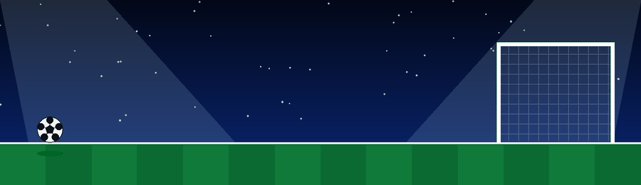

  

### 🎨 Proyecto de práctica con HTML5 y CSS3

⚽ 🏟️ 🎥 🎨 💻 🚀 ✨ 🏆

## 📸 Vista Previa

  

## ✨ Características

  

## 🛠️ Tecnologías

## 👨‍💻 Autor

**Angel Esteban Rivera Camayo**

🎓 SENA • 🚀 Desarrollo Web

